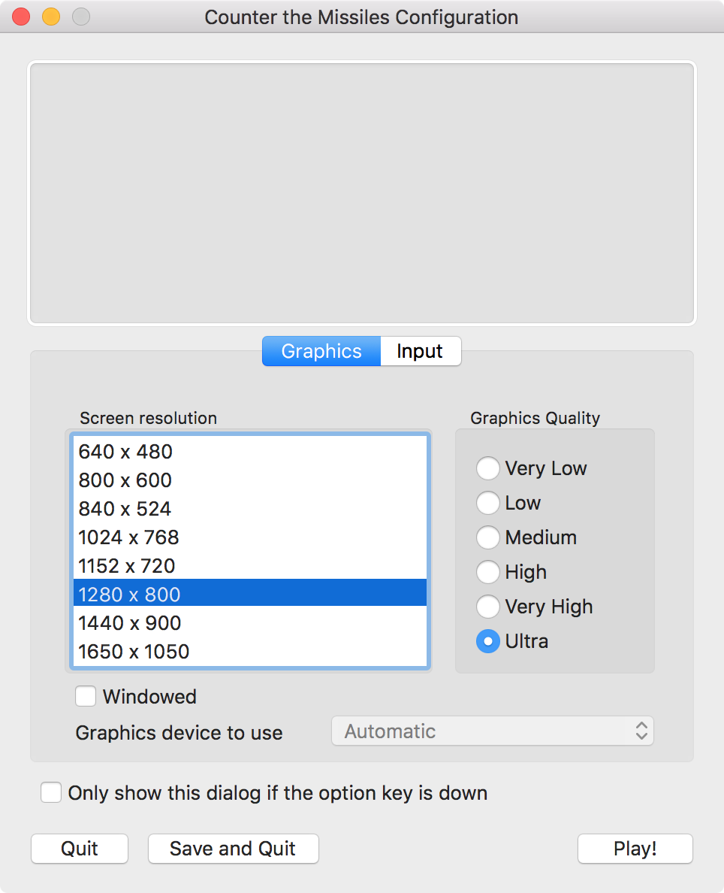

# The Release Folder

This folder contains playable builds of the game. You can download and try these builds on supported devices.

The game currently supports Windows and macOS (and soon, Android).

# Get the Right Version
## Windows users
Click on the file named "Counter the Missiles (Windows x86).zip" and then click "Download", which appears near the right.

Once downloaded, right-click on the .zip folder and select "Extract All". Choose anywhere to extract the contents to.

Once extraction is complete, click on the .exe file to run the game.

## macOS users
Click on the file named "Counter the Missiles (macOS).app" and then click "Download", which appears near the right.

Once downloaded, simply left-click on the downloaded file. This will launch the game.

You may see the following window when launching the game:

You can leave the settings at default and simply hit on "Play!" (on the bottom-right corner of the window) to start playing the game.

### Screen Resolution
On the left, you can choose the screen resolution of the game. Lower resolutions result in higher performance, but will cause the game to look blurry. Since Counter the Missiles is a simple game, using a higher resolution should be fine.

### Graphics Quality
On the right, you can choose the quality of the game. For now, this setting doesn't do anything in the game.

### Windowed
On the bottom of the Screen Resolution dialog, you can choose if you want to "window" the game or let it take up the whole screen space of your computer.

### Graphics Device to Use
Here, you can choose which graphics device to use for running this game. By default, the game is set to automatically use the best graphics device to render the game.

Note that this option may be greyed out if you only have one graphics device.

### Only show this dialog if the option key is down
If this option is checked, this window will only open when the option key is pressed down while the game is launched.

### Quiting and Saving Preferences
Clicking on "Quit" simply closes the window. This is the same as clicking on the red button on the top-left corner or hitting ⌘ + Q.

Clicking on "Save and Quit" closes the window and saves your choices you made for the screen resolution and graphics quality. Note that this doesn't save your preferences on running the game in fullscreen or windowed mode.

The next time you open the game, your preferences will be preserved.

# Reporting
Found a bug or just want to suggest a feature? Feel free to leave an issue here: https://github.com/Brandon-Gui123/counter-the-missiles/issues